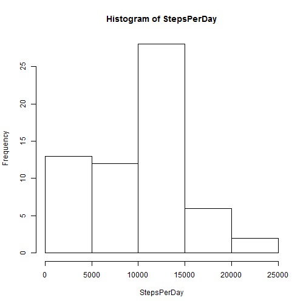
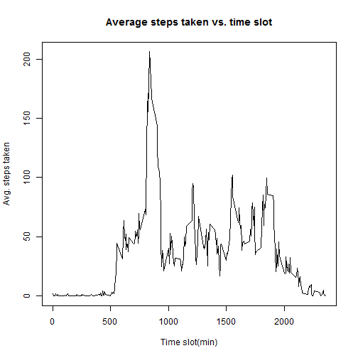
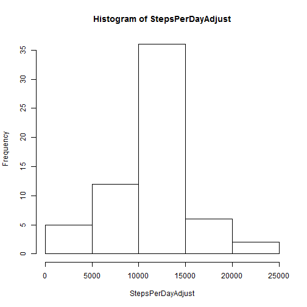
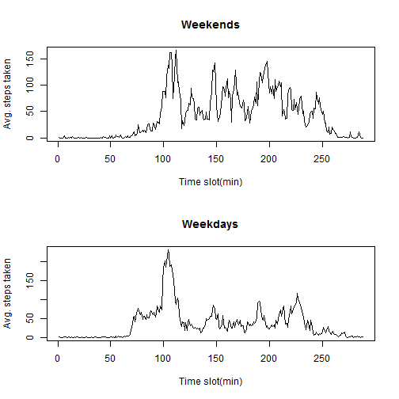

# Peer Assessment 1

**Loading and preprocessing the data**

Load necessary libraries

```r
library(dplyr)
library(tidyr)
```

Read data into a data frame

```r
AD <- read.csv("./activity.csv", header = TRUE)
ActivityData <- tbl_df(AD)
```

**What is mean total number of steps taken per day?**

Calculates the total number of steps for each given day with NA values removed

```r
StepsPerDay <- by(ActivityData$steps, 
                  na.rm =TRUE, ActivityData$date, sum)
```

Plot a histogram of the steps per day

```r
hist(StepsPerDay)
```

 

Calculate the mean and median of the steps per day and the number of missing values in the data

```r
MeanPerDay <- mean(StepsPerDay)
MedianPerDay <- median(StepsPerDay)
NumMissVal <- (is.na(ActivityData))
```
_**The mean number of steps per day = 9354.23**_

_**The median number of steps per day = 10395**_

**What is the average daily activity pattern?**

Create new lists containing the unique dates and time intervals

```r
Intervals <- unique(factor(ActivityData$interval))
Dates <- unique(factor(ActivityData$date))
```

Calculates the means for each and every time slot over all the days

```r
MeansForEachTimeSlot <- list()
for (i in seq_along(Intervals)){
    MeansForEachTimeSlot[i] <- mean(subset(ActivityData, 
                            ActivityData$interval == Intervals[i])$steps, 
                            na.rm =TRUE)
}
```

Plot the data in a time series plot

```r
plot(as.numeric(as.character(Intervals)), MeansForEachTimeSlot, 
     main= "Average steps taken vs. time slot", 
     xlab="Time slot(min)", ylab="Avg. steps taken",type = "l")
```

 

Find max value for daily steps and the correspoding time slot.

```r
TimeSlotWithMax <- Intervals[which.max(MeansForEachTimeSlot)]
```

_**The 5-minute interval which, on average across all the days in the dataset, contains the maximum number of steps = 835**_

**Imputing missing values**

There are a number of days/intervals where there are missing values (coded as NA). The presence of missing days may introduce bias into some calculations or summaries of the data. This section of processing explores the occurences of the missing values
and replaces them with appropriate estimates.

Using the following code it is seen that all NA values are concentrated in the 
_steps_ column.

```r
StepsNA = sum(is.na(ActivityData$steps))
DateNA = sum(is.na(ActivityData$date))
IntervalNA = sum(is.na(ActivityData$interval))
```
Missing values in the _steps_ column = 2304

Missing values in the _date_ column = 0

Missing values in the _interval_ column = 0

In this analysis, a new dataset is created with the missing values replaced with the mean value for each 5 minutes time slot (which was calculated above in the time-series plot section)

```r
ActivityDataAdjust <- ActivityData %.%
    mutate(steps = ifelse(is.na(steps),as.numeric(MeansForEachTimeSlot),steps))
```

Calculate the total number of steps for each given day with NA replaced above and plots a histogram of the steps per day

```r
StepsPerDayAdjust <- by(ActivityDataAdjust$steps, 
                  na.rm =FALSE, ActivityDataAdjust$date, sum)

hist(StepsPerDayAdjust)
```

 

Calculate the mean and median of the steps per day of the adjusted data

```r
MeanPerDayAdjust <- mean(StepsPerDayAdjust)
MedianPerDayAdjust <- median(StepsPerDayAdjust)
```
_**The adjusted mean number of steps per day = 10766.2**_

_**The adjusted median number of steps per day = 10766.2**_

Compare mean and median before and after adjusting via the numbers MnRatio and MdRatio 

```r
MnRatio <- MeanPerDayAdjust/MeanPerDay
MdRatio <- MedianPerDayAdjust/MedianPerDay
```

_**The Adjusted mean is 1.1509 times the original (unadjusted) mean.**_

_**The Adjusted median is 1.0357 times the original (unadjusted) median.**_

Replacing the NA values with non-zero numbers results in an increase of both the mean and the median values of the steps per day (approximately 10% for the mean and approximately 3% for the median). This is to be expected since we are adding numbers to the steps per day where there were none previously.

**Are there differences in activity patterns between weekdays and weekends?**

Note that the strategy employed herein deviates somewhat from that suggested in the project instructions. However, since the grading rubric does not specify a particular method, I have left this as is. The output is the same as would have been produced otherwise. 

Create data frames that contain a column with days of the week

```r
ActivityDataAdjustDays <- mutate(ActivityDataAdjust, 
                          dayofweek = weekdays(as.Date(ActivityDataAdjust$date)))
```

Create data frames that contain only weekdays and only weekends respectively

```r
ActivityDataAdjustWeekends <- filter(ActivityDataAdjust, 
                            weekdays(as.Date(ActivityDataAdjust$date)) 
                            == "Saturday"|weekdays(as.Date(ActivityDataAdjust$date)) 
                            == "Sunday")

ActivityDataAdjustWeekdays <- filter(ActivityDataAdjust, 
                            !(weekdays(as.Date(ActivityDataAdjust$date)) 
                            == "Saturday"|weekdays(as.Date(ActivityDataAdjust$date)) 
                            == "Sunday"))
```

Calculates the means for each and every time slot over all the days for weekends and weekends separately

```r
MeansForEachTimeSlotWeekends <- list()
for (j in seq_along(Intervals)){
    MeansForEachTimeSlotWeekends[j] <- mean(subset(ActivityDataAdjustWeekends, 
                                    ActivityDataAdjustWeekends$interval 
                                    == Intervals[j])$steps)
}

MeansForEachTimeSlotWeekdays <- list()
for (k in seq_along(Intervals)){
    MeansForEachTimeSlotWeekdays[k] <- mean(subset(ActivityDataAdjustWeekdays, 
                                                   ActivityDataAdjustWeekdays$interval 
                                                   == Intervals[k])$steps)
}
```

Plot the weekday and weekend data in time series plots

```r
par(mfrow=c(2,1))
plot(as.numeric(Intervals), as.numeric(MeansForEachTimeSlotWeekends), 
     main= "Weekends", 
     xlab="Time slot(min)", ylab="Avg. steps taken",type = "l")

plot(as.numeric(Intervals), as.numeric(MeansForEachTimeSlotWeekdays), 
     main= "Weekdays", 
     xlab="Time slot(min)", ylab="Avg. steps taken",type = "l")
```

 
